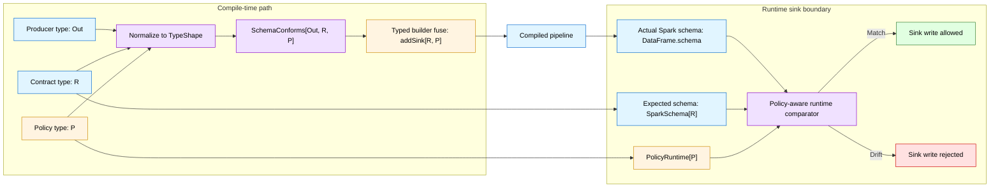

# Mermaid-ready figure drafts

These are Mermaid-first drafts for the first paper figures.

Rules applied from the local Mermaid playbook:

- labels with special characters are quoted
- shapes stay simple
- colors use `fill`, `stroke`, and `color:#000`
- semantic colors stay consistent across figures

Table 1 remains a markdown table, not a Mermaid figure.

## Figure 1: compile-time proof plus runtime pin architecture

Caption draft:
The same contract type `R` drives both compile-time proof and the runtime sink pin. Compile time rejects declared producer-to-contract drift in code. Runtime re-checks the actual Spark schema before write because external data boundaries can still violate the declared type path.

Notes:

- Keep `Out`, `R`, and `P` in the final figure because they match the paper text.
- If the camera-ready version needs less width, stack the runtime subgraph under the compile-time subgraph.
- Do not add extra boxes for examples or benchmarks here. The point is the enforcement path.

## Figure 2: policy family at a glance

Caption draft:
The artifact supports exact-style, subset-style, and escape-hatch policies. Exact-style policies differ on name and order sensitivity. Subset-style policies make direction explicit: `Backward` allows producer extras, while `Forward` allows the contract to contain more fields. Nested collection optionality is checked across all policies except `Full`.

```mermaid
flowchart TD
  ROOT["SchemaPolicy family"]

  subgraph EXACT["Exact-style policies"]
    EXACT_DEFAULT["Exact / ExactUnorderedCI<br/>unordered by name<br/>case-insensitive<br/>no extras, no missing<br/>nested optionality checked"]
    EXACT_ORDERED["ExactOrdered<br/>ordered by name<br/>case-sensitive<br/>no extras, no missing<br/>nested optionality checked"]
    EXACT_ORDERED_CI["ExactOrderedCI<br/>ordered by name<br/>case-insensitive<br/>no extras, no missing<br/>nested optionality checked"]
    EXACT_POS["ExactByPosition<br/>by position<br/>names ignored<br/>no extras, no missing<br/>nested optionality checked"]
  end

  subgraph SUBSET["Subset-style policies"]
    BACKWARD["Backward<br/>contract subset of producer<br/>producer extras allowed<br/>missing contract fields allowed only when optional or defaulted<br/>nested optionality checked"]
    FORWARD["Forward<br/>producer subset of contract<br/>producer extras rejected<br/>contract may contain more fields<br/>nested optionality checked"]
  end

  subgraph ESCAPE["Escape hatch"]
    FULL["Full<br/>accept all<br/>used only when enforcement is intentionally disabled"]
  end

  ROOT --> EXACT_DEFAULT
  ROOT --> EXACT_ORDERED
  ROOT --> EXACT_ORDERED_CI
  ROOT --> EXACT_POS
  ROOT --> BACKWARD
  ROOT --> FORWARD
  ROOT --> FULL

  style ROOT fill:#e1f5ff,stroke:#0066cc,color:#000
  style EXACT_DEFAULT fill:#f0e1ff,stroke:#8800cc,color:#000
  style EXACT_ORDERED fill:#f0e1ff,stroke:#8800cc,color:#000
  style EXACT_ORDERED_CI fill:#f0e1ff,stroke:#8800cc,color:#000
  style EXACT_POS fill:#f0e1ff,stroke:#8800cc,color:#000
  style BACKWARD fill:#fff4e1,stroke:#cc8800,color:#000
  style FORWARD fill:#fff4e1,stroke:#cc8800,color:#000
  style FULL fill:#ffe1e1,stroke:#cc0000,color:#000
```

Notes:

- This is a reviewer-facing overview figure, not the final policy table.
- In the paper body, Figure 2 can be followed immediately by the precise markdown or LaTeX table from [figures-notes.md](figures-notes.md).
- If Mermaid rendering feels too tall, split this into two small figures: exact-style policies and subset-style policies.

## Table 1: benchmark summary stays as a table

Keep Table 1 as a regular table, using the numbers already frozen in [figures-notes.md](figures-notes.md) and the saved benchmark summaries under [benchmarks/results](../../benchmarks/results).
